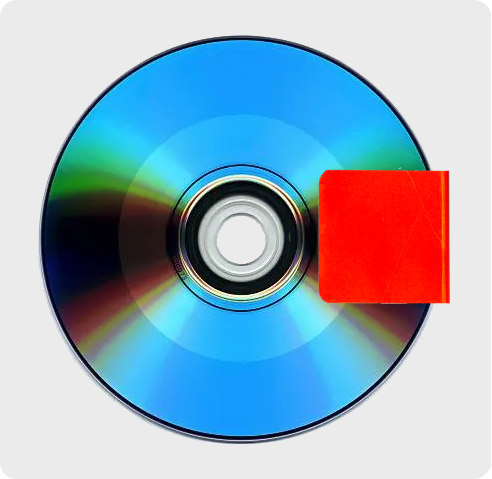
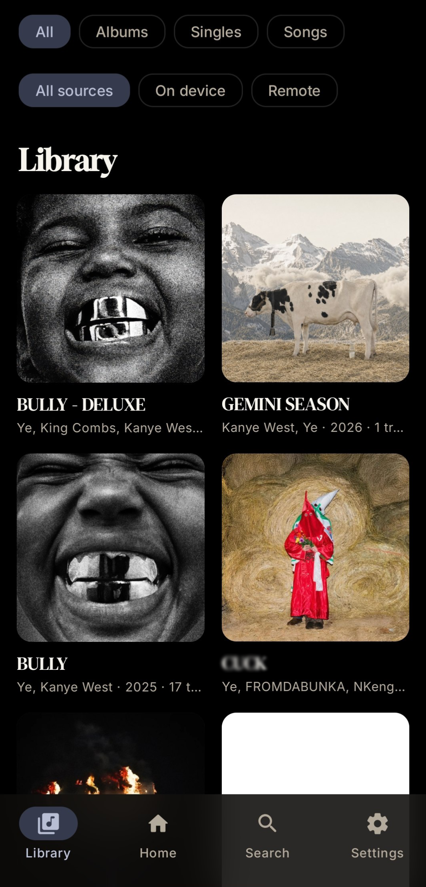
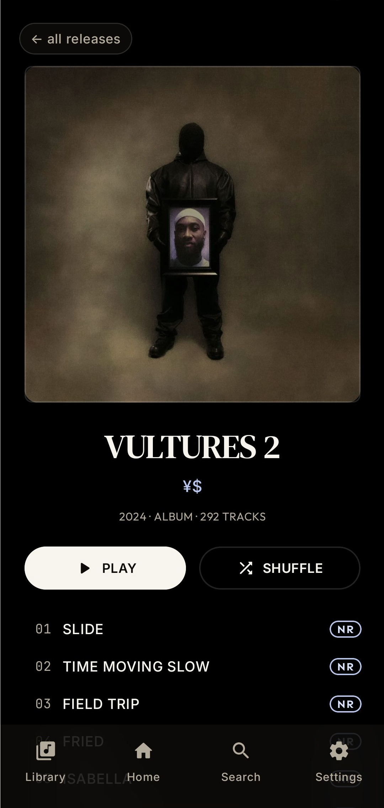
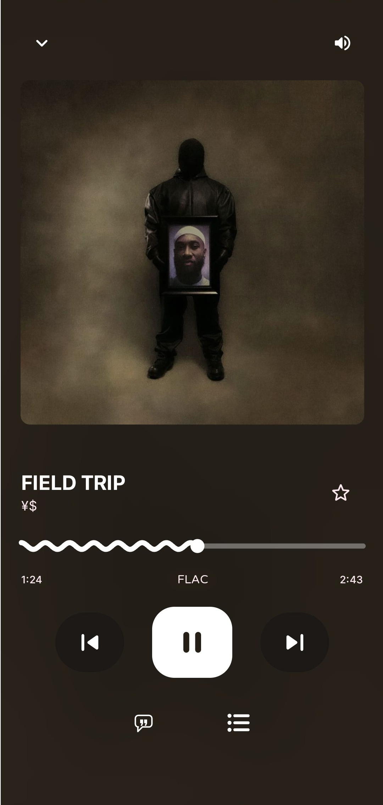
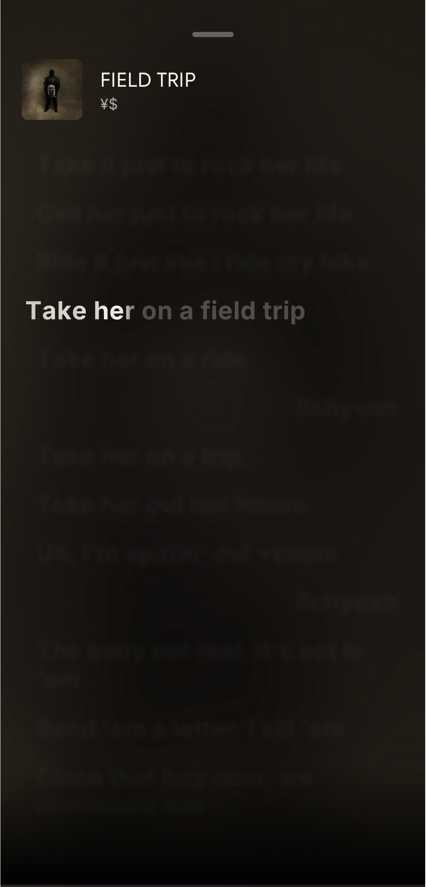

<h1 align="center">starkill</h1>

  <strong>A Android local music player with simple & animated design</strong> 
  Material 3 Expressive, Apple Music like lyrics, streaming from self-hosted

  
  
  
  

# Features
- **Letter-by-letter lyrics** _(Apple Music 1:1)_
- **Hi-Res Lossless playback**
- **Tag system** _(only trough remote library if supported so)_
- **Playful animated M3E interface** _(Material 3 Expressive)_
- **Remote library & streaming from them support** _(self hosted library with minimal setup)_
- **Lightweight** _(by performance && app size)_
- **Build-in libraries, includes artists like Ye** _(by going to "Settings" -> "Libraries" -> Click button "Build-in Libraries" -> "Ye/Kanye (Full)")_
- **Listening statistics** _(how much was spent listening to artist/playlist/track/album per day/weeks/months/all time)_

#### All releases support any Android architecture _(like v8, v7a, x86_64 and other)_
